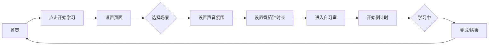

## 1. 产品概述
StudyWithMe AI 自习室是一款沉浸式学习辅助应用，通过自然场景背景、氛围音乐和番茄钟功能帮助用户提升专注力。

## 2. 核心功能

### 2.1 用户角色
| 角色 | 注册方式 | 核心权限 |
|------|----------|----------|
| 用户 | 无需注册 | 使用自习室全部功能 |

### 2.2 功能模块
1. **首页**: 沉浸式背景、开始学习入口、导航
2. **设置页面**: 场景选择、声音氛围设置、番茄钟时长设置
3. **自习室页面**: 倒计时、播放控制、今日目标输入、进度显示

### 2.3 页面详情
| 页面名称 | 模块名称 | 功能描述 |
|----------|----------|----------|
| 首页 | Hero区域 | 全屏自然场景背景、品牌标识、开始学习按钮 |
| 设置页面 | 场景选择 | 4种场景卡片（清晨窗边、雨天咖啡店、深夜图书馆、海边书房） |
| 设置页面 | 声音设置 | 音乐和背景音滑块控制 |
| 设置页面 | 番茄钟设置 | 可选时长：25/45/50/90分钟 |
| 自习室页面 | 计时器 | 显示剩余时间、本轮进度条 |
| 自习室页面 | 控制栏 | 音乐音量、背景音音量、暂停、跳过、重置、结束学习按钮 |

## 3. 核心流程

用户进入首页 → 点击开始学习 → 选择场景、设置声音和番茄钟 → 进入自习室 → 开始专注学习 → 完成或结束学习

## 4. 用户界面设计

### 4.1 设计风格
- 主色调：自然色系，柔和的米色、绿色、蓝色
- 按钮风格：毛玻璃效果，圆角设计
- 字体：优雅的无衬线字体
- 布局：沉浸式全屏设计，卡片式设置面板
- 图标：简约线性图标

### 4.2 页面设计概述
| 页面名称 | 模块名称 | UI元素 |
|----------|----------|--------|
| 首页 | Hero区域 | 全屏自然背景图、品牌logo、标题文字、CTA按钮 |
| 设置页面 | 场景选择 | 4张场景卡片，带场景名称和描述 |
| 设置页面 | 声音设置 | 两个滑块控制音乐和背景音音量 |
| 设置页面 | 番茄钟设置 | 4个时长选项按钮 |
| 自习室页面 | 计时器 | 大字号倒计时数字、进度条、状态标签 |
| 自习室页面 | 控制栏 | 音量滑块、功能按钮组 |

### 4.3 响应式设计
- 桌面端优先设计
- 移动端自适应布局调整
- 触控友好的按钮尺寸

### 4.4 视觉效果
- 毛玻璃效果（glassmorphism）
- 柔和的渐变背景
- 平滑过渡动画
- 沉浸式全屏体验