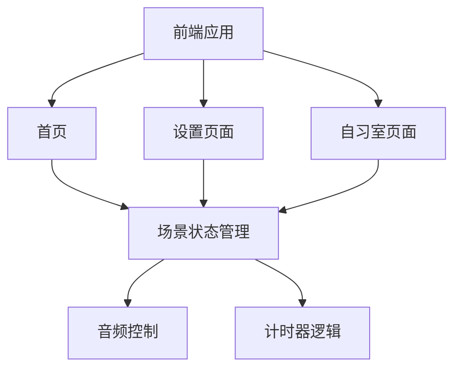

## 1. 架构设计



## 2. 技术描述
- Frontend: React@18 + tailwindcss@3 + vite@6
- 图标库: lucide-react
- 状态管理: React useState/useContext
- 音频: Web Audio API

## 3. 路由定义
| 路由 | 用途 |
|------|------|
| / | 首页 |
| /settings | 设置页面 |
| /study | 自习室页面 |

## 4. 组件结构
```
src/
├── components/
│   ├── Header.jsx          # 导航头部
│   ├── SceneCard.jsx       # 场景选择卡片
│   ├── Timer.jsx           # 计时器组件
│   ├── ControlBar.jsx      # 控制栏
│   └── GlassCard.jsx       # 毛玻璃卡片容器
├── pages/
│   ├── Home.jsx            # 首页
│   ├── Settings.jsx        # 设置页面
│   └── StudyRoom.jsx       # 自习室页面
├── context/
│   └── AppContext.jsx      # 全局状态管理
├── data/
│   └── scenes.js           # 场景数据
├── hooks/
│   └── useTimer.js         # 计时器hook
└── App.jsx                 # 主应用入口
```

## 5. 数据模型

### 场景数据
```javascript
{
  id: string,
  name: string,
  description: string,
  background: string,
  icon: string
}
```

### 设置状态
```javascript
{
  scene: object,      // 当前场景
  musicVolume: number, // 音乐音量 0-100
  bgVolume: number,    // 背景音音量 0-100
  timerDuration: number // 番茄钟时长（分钟）
}
```